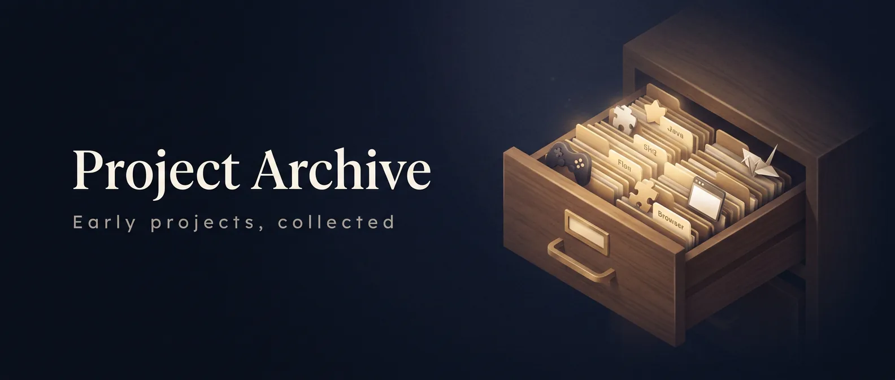

<p align="center"></p>

# Project Archive

Early learning projects, mini-games, browser extensions, and studies collected in one place.

This monorepo is a **home base** for old work (many of these lived under `SpecialistWealth` as separate repos). The plan is to revive them slowly — polish one project at a time, document it properly, and promote the good ones into standalone repos when they deserve it.

> Status: **archive / work-in-progress**. Expect rough edges, auto-generated GitHub names, and incomplete docs. That is intentional.

---

## How this repo is meant to be used

1. **Browse** — every folder below is a self-contained mini-project.
2. **Improve one at a time** — pick a project, open a branch, clean it up, update its README.
3. **Graduate** — when a project is ready for prime time, split it into its own repo (or leave a polished copy here as a snapshot).

Suggested branch naming when you start polishing:

```text
polish/<project-folder-name>
```

---

## Catalog

### Browser extensions

| Folder | What it is | Notes |
| --- | --- | --- |
| [`SakuraFlow/`](SakuraFlow/) | Tab manager extension (search / close tabs, sakura-themed UI) | Standalone copy of the extension |
| [`focus/`](focus/) | Focus mode: block distracting sites on a schedule | README only so far — flesh out when revived |
| [`browserbuddy/`](browserbuddy/) | [Hack Club BrowserBuddy](https://browserbuddy.hackclub.com/) program materials: site + extension submissions | Largest folder; mix of program site and extension work |

### Mini-games & interactive HTML

| Folder | What it is |
| --- | --- |
| [`lantern-game/`](lantern-game/) | Lantern click game (with sound) |
| [`Number-game/`](Number-game/) | Guess-the-number game |
| [`ideal-spoon/`](ideal-spoon/) | Shape matching game |
| [`effective-succotash/`](effective-succotash/) | Simple cube game |
| [`cuddly-palm-tree/`](cuddly-palm-tree/) | Simple dice game (C++ / related) |

### Learning sites (HTML practice)

| Folder | Topic |
| --- | --- |
| [`The-Brown-Bear/`](The-Brown-Bear/) | Brown bear info page (HTML elements practice) |
| [`upgraded-eureka/`](upgraded-eureka/) | Wolves website |
| [`bookish-octo-robot/`](bookish-octo-robot/) | Wolves page + images |
| [`Great-Owl/`](Great-Owl/) | Great Horned Owl page |
| [`Great-horned-owl/`](Great-horned-owl/) | Great Horned Owl page (variant) |

### Languages & studies

| Folder | What it is |
| --- | --- |
| [`C-plus-plus-/`](C-plus-plus-/) | C++ fundamentals practice |
| [`crispy-happiness/`](crispy-happiness/) | C++ dice / RNG practice |
| [`super-guide-python/`](super-guide-python/) | Python learning notes & basics |
| [`FinTech-Blockchain-Studies/`](FinTech-Blockchain-Studies/) | Literature review / notes: blockchain in finance (weekly summaries + PDF) |

---

## Layout

```text
project-archive/
├── README.md                 ← you are here
├── .gitignore
├── SakuraFlow/               ← extension
├── focus/
├── browserbuddy/             ← program + many extension samples
├── lantern-game/             ← HTML games …
├── Number-game/
├── …
├── C-plus-plus-/             ← language practice …
├── super-guide-python/
└── FinTech-Blockchain-Studies/
```

Each subfolder was originally its own small git repo. Nested `.git` directories were stripped so this monorepo has a single history going forward.

---

## Working on a single project later

```bash
# clone once
git clone https://github.com/ronithrashmikara/project-archive.git
cd project-archive

# polish one project
git checkout -b polish/lantern-game
# …edit lantern-game/ …
git add lantern-game
git commit -m "Polish lantern-game: clearer UI and README"
git push -u origin polish/lantern-game
```

Open `index.html` in a browser for static HTML games. For extensions, load the unpacked folder in Chrome/Edge (`chrome://extensions` → Developer mode → Load unpacked).

---

## Origins

| | |
| --- | --- |
| **Author** | [ronithrashmikara](https://github.com/ronithrashmikara) |
| **Earlier home** | Local archive under `SpecialistWealth-Repos` (former `SpecialistWealth/*` repos) |
| **Intent** | Keep history in one place, revive gradually, not rewrite everything on day one |

---

## License

Individual folders may carry their own `LICENSE` (especially under `browserbuddy/`). Unless noted otherwise, treat code here as personal learning material.

---

*Start small. Ship one polished project when you are ready.*
